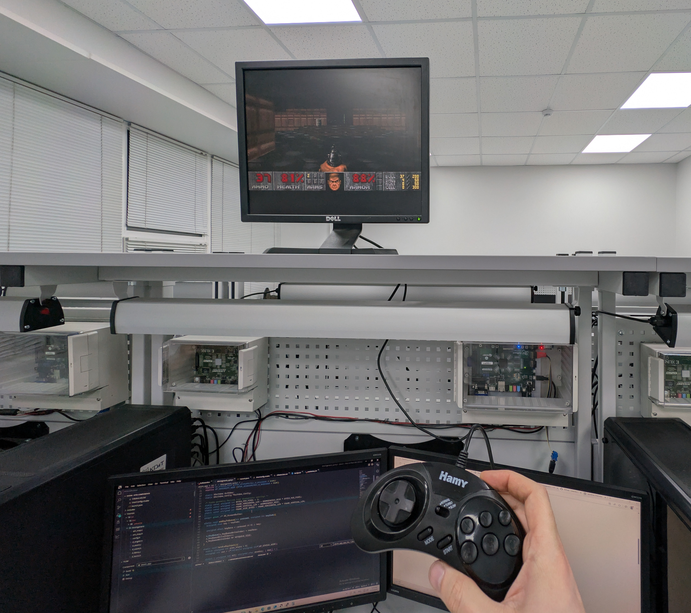

# Doom on baremetal SoC
This is an implementation of Doom for FPGA-enabled Zynq-7000 System-on-a-Chip (XC7Z020 CLG484 to be exact).



This project is based on [doomgeneric](https://github.com/ozkl/doomgeneric/tree/fc601639494e089702a1ada082eb51aaafc03722), which claims to be easy to port to other platforms.

This project was done for a university course, and so, is entirely unmaintained.

## Hardware
The platform has 3 main components:
- the ARM processor with 2 cores,
- AXI Video Direct Memory Access IP Core,
- Custom 7-pin Sega gamepad driver IP Core.

Both IP Cores are implemented in programmable logic.

The gamepad driver polls the gamepad and saves button state in its registers.
The processor reads those registers, runs doom, and copies the video to memory.
The VDMA core continuously streams video data from the memory buffer over VGA.

The `hw/` directory only contains the stuff I wrote, because you'd probably need to reimplement everything for your own hardware.

## Software
The whole process will run directly on the CPU, without any operating system, only with the help of standard library provided by xilinx.

Only 5 functions from doomgeneric need to be implemented:

|Functions            |Description|
|---------------------|-----------|
|DG_Init              |Initialize your platfrom (create window, framebuffer, etc...).
|DG_DrawFrame         |Frame is ready in DG_ScreenBuffer. Copy it to your platform's screen.
|DG_SleepMs           |Sleep in milliseconds.
|DG_GetTicksMs        |The ticks passed since launch in milliseconds.
|DG_GetKey            |Provide keyboard events.
|DG_SetWindowTitle    |Not required. This is for setting the window title as Doom sets this from WAD file.

Everything below is kind of a tutorial on how I did it.

### doomgeneric_zync.c implementation
`doomgeneric_zynq.c` is based on `doomgeneric_sdl.c`.

#### Time handling
```c
#include "xiltimer.h"

void DG_SleepMs(uint32_t ms)
{
    usleep(ms * 1000);
}

uint32_t DG_GetTicksMs()
{
    XTime t;
    XTime_GetTime(&t);
    return (uint32_t)(t / (COUNTS_PER_SECOND / 1000));
}
```
#### Reading gamepad buttons
The gamepad button state is split into bits for each button, and if it's state has changed since the last time, an event is added to the queue.
```c
#include "xparameters.h"
#include "doomkeys.h"

#define KEYQUEUE_SIZE 16
#define GP_VERSION_ADDR (XPAR_SEGAGAMEPAD2_0_BASEADDR + 0x00)
#define GP_CONTROL_ADDR (XPAR_SEGAGAMEPAD2_0_BASEADDR + 0x04)
#define GP_STATUS_ADDR (XPAR_SEGAGAMEPAD2_0_BASEADDR + 0x08)
#define GP_INTERRUPT_ADDR (XPAR_SEGAGAMEPAD2_0_BASEADDR + 0x0C)

static unsigned short s_KeyQueue[KEYQUEUE_SIZE];
static unsigned int s_KeyQueueWriteIndex = 0;
static unsigned int s_KeyQueueReadIndex = 0;

static void addKeyToQueue(int pressed, unsigned int keyCode){
	unsigned char key = keyCode;
	unsigned short keyData = (pressed << 8) | key;
	
	s_KeyQueue[s_KeyQueueWriteIndex] = keyData;
	s_KeyQueueWriteIndex++;
	s_KeyQueueWriteIndex %= KEYQUEUE_SIZE;
}

static void handleKeyInput(){
	static unsigned int prev_state = 0;
	unsigned int cur = (*(volatile unsigned int*)GP_STATUS_ADDR);
	
	struct { unsigned int bit; unsigned char doomkey; } map[] = {
		{ (1<<0), KEY_UPARROW },
		{ (1<<1), KEY_DOWNARROW },
		{ (1<<2), KEY_LEFTARROW },
		{ (1<<3), KEY_RIGHTARROW },
		{ (1<<4), KEY_FIRE },   // A
		{ (1<<5), KEY_USE },    // B
		{ (1<<6), KEY_RSHIFT }, // C
		{ (1<<7), KEY_ENTER },  // START
		{ (1<<8), 'x' },        // X -> raw char
		{ (1<<9), 'y' },        // Y -> raw char
		{ (1<<10), 'z' },       // Z -> raw char
		{ (1<<11), KEY_TAB }    // Mode -> map to TAB
	};
	
	int map_count = sizeof(map)/sizeof(map[0]);
	for (int i = 0; i < map_count; ++i) {
		unsigned int bit = map[i].bit;
		unsigned int was = (prev_state & bit) != 0;
		unsigned int is = (cur & bit) != 0;
		if (was != is) {
			addKeyToQueue(is ? 1 : 0, map[i].doomkey);
		}
	}
	
	prev_state = cur;
}
```

`DG_GetKey` is identical to the SDL version.

Gamepad state is read after rendering the frame, just like in the SDL version.

```c
void DG_DrawFrame()
{
    ...
    
    handleKeyInput();
}
```

During initialization, the gamepad IP core and automatic polling for extra buttons (via the select pin) are enabled.

```c
void DG_Init(){
    (*(volatile unsigned int*)GP_CONTROL_ADDR) = 3;
    
    ...   
}
```

#### Video output
```c
#include "m_argv.h"
#include "doomgeneric.h"

#include <stdio.h>

#include "xparameters.h"
#include "xil_printf.h"
#include "xaxivdma.h"
#include "xil_cache.h"

#define DDR_BASE_ADDR XPAR_DDR_MEM_BASEADDR
#define READ_ADDRESS_BASE (DDR_BASE_ADDR + 0x01000000)

static XAxiVdma AxiVdma;
static XAxiVdma_Config *AxiVdma_Config;

/* Frame geometry derived from doomgeneric settings */
static const unsigned int BYTES_PER_PIXEL = 3;
static const unsigned int FRAME_HORIZONTAL_LEN = DOOMGENERIC_RESX * BYTES_PER_PIXEL;
static const unsigned int FRAME_VERTICAL_LEN = DOOMGENERIC_RESY;
static const unsigned int FRAME_SIZE_BYTES = FRAME_HORIZONTAL_LEN * FRAME_VERTICAL_LEN;

extern pixel_t* DG_ScreenBuffer;

void DG_Init(){
    int Status;

    /* Initialize VDMA */
    AxiVdma_Config = XAxiVdma_LookupConfig(XPAR_XAXIVDMA_0_BASEADDR);
    if (!AxiVdma_Config) {
      xil_printf("VDMA config lookup failed\r\n");
      return;
    }

    Status = XAxiVdma_CfgInitialize(&AxiVdma, AxiVdma_Config, AxiVdma_Config->BaseAddress);
    if (Status != XST_SUCCESS) {
      xil_printf("VDMA cfg initialize failed\r\n");
      return;
    }

    Status = XAxiVdma_Selftest(&AxiVdma);
    if (Status != XST_SUCCESS) {
      xil_printf("VDMA selftest failed\r\n");
    }

    /* configure frame counter */
    XAxiVdma_FrameCounter FrameCfg;
    FrameCfg.ReadFrameCount = AxiVdma_Config->MaxFrameStoreNum;
    FrameCfg.WriteFrameCount = AxiVdma_Config->MaxFrameStoreNum;
    Status = XAxiVdma_SetFrameCounter(&AxiVdma, &FrameCfg);
    if (Status != XST_SUCCESS) {
      xil_printf("VDMA set frame counter failed\r\n");
    }

    /* configure read channel */
    XAxiVdma_DmaSetup ReadCfg;
    ReadCfg.VertSizeInput = FRAME_VERTICAL_LEN;
    ReadCfg.HoriSizeInput = FRAME_HORIZONTAL_LEN;
    ReadCfg.Stride = FRAME_HORIZONTAL_LEN;
    ReadCfg.FrameDelay = 0;
    ReadCfg.EnableCircularBuf = 1;
    ReadCfg.EnableSync = 0;
    ReadCfg.PointNum = 0;
    ReadCfg.EnableFrameCounter = 0;
    ReadCfg.FixedFrameStoreAddr = 0;

    Status = XAxiVdma_DmaConfig(&AxiVdma, XAXIVDMA_READ, &ReadCfg);
    if (Status != XST_SUCCESS) {
      xil_printf("VDMA dma config failed\r\n");
    }

    /* populate frame store addresses */
    UINTPTR frameAddr = READ_ADDRESS_BASE;
    for (int i = 0; i < FrameCfg.ReadFrameCount; ++i) {
      ReadCfg.FrameStoreStartAddr[i] = frameAddr;
      frameAddr += FRAME_SIZE_BYTES;
    }

    Status = XAxiVdma_DmaSetBufferAddr(&AxiVdma, XAXIVDMA_READ, ReadCfg.FrameStoreStartAddr);
    if (Status != XST_SUCCESS) {
      xil_printf("VDMA set buffer addr failed\r\n");
    }

    Status = XAxiVdma_DmaStart(&AxiVdma, XAXIVDMA_READ);
    if (Status != XST_SUCCESS) {
      xil_printf("VDMA dma start failed\r\n");
    }
}
```
doomgeneric uses 4-byte pixels, so when writing to the buffer we need to convert each pixel by copying only the RGB channels into the buffer.

```c
int BufferDraw(int frameNum) {
    UINTPTR frameAddr = (READ_ADDRESS_BASE) + (frameNum * FRAME_SIZE_BYTES);
    u16 x, y;
    u8 *addr = (u8 *)frameAddr;
    u32 i = 0;
    for (y = 0; y < DOOMGENERIC_RESY; y++) {
        for (x = 0; x < DOOMGENERIC_RESX; x++) {
            pixel_t p = DG_ScreenBuffer[i];
            i++;
            *addr++ = p & 0xFF;
            *addr++ = (p >> 8) & 0xFF;
            *addr++ = (p >> 16) & 0xFF;
        }
    }
    Xil_DCacheFlushRange(frameAddr, FRAME_SIZE_BYTES);
    return XST_SUCCESS;
}
```

The VDMA core is configured with 2 frames, so we use ping-pong frame buffers. For vertical synchronization we rely on doom itself (which is surprisingly good at it).

```c
void DG_DrawFrame()
{
    u32 cur = XAxiVdma_CurrFrameStore(&AxiVdma, XAXIVDMA_READ);
    u32 max = AxiVdma_Config->MaxFrameStoreNum;
    u32 frame_number = (cur + 1) % max;

    BufferDraw(frame_number);

    int Status = XAxiVdma_StartParking(&AxiVdma, frame_number, XAXIVDMA_READ);
    if (Status != XST_SUCCESS) {
      xil_printf("VDMA start parking failed\r\n");
    }

    handleKeyInput();
}
```

Since the image is be displayed directly on the screen, there is nowhere to put the window title.

`main` remains unchanged, `DG_SetWindowTitle` does nothing.

```c
void DG_SetWindowTitle(const char * title) { (void)title; }

int main(int argc, char **argv)
{
    doomgeneric_Create(argc, argv);

    for (int i = 0; ; i++)
    {
        doomgeneric_Tick();
    }
    
    return 0;
}
```

### Other changes
#### Settings
First, add all game files to the Include Paths (-I) and Compile Sources in the `UserConfig.cmake` settings.

In `doomfeatures.h` uncomment:
```c
#undef FEATURE_SOUND
```
In `doomgeneric.h` change:
```c
#define DOOMGENERIC_RESY 480 // 400
```

#### Heap memory
doomgeneric requires at least 6 MB of memory. By default only 8 KB is allocated for the heap, so set the heap size to 10MB in the `lscript.ld`.

#### System calls
For some reason, when compiling the project the functions for the system calls `_link` and `_unlink` are not provided by xilinx libraries, so we provide stubs.
```c
#include <sys/types.h>
#include <sys/stat.h>
#include <errno.h>
#include <stddef.h>

int _link(const char *oldpath, const char *newpath) {
    (void)oldpath; (void)newpath;
    errno = ENOSYS;
    __asm volatile("bkpt #0");
    return -1;
}
int _unlink(const char *pathname) {
    (void)pathname;
    errno = ENOENT;
    __asm volatile("bkpt #0");
    return -1;
}
```

#### doom1.wad
To load the game's data, we must provide the `doom1.wad` file. However, since there are no storage devices, this file needs to be embedded directly into the program memory and passed to doom.

First convert the file to a linkable object:
```sh
arm-none-eabi-objcopy \
  -I binary \
  -O elf32-littlearm \
  -B arm \
  doom1.wad doom1_wad.o
```

Then link `doom1_wad.o` to the project in `UserConfig.cmake`:
```
set(USER_COMPILE_SOURCES
    ...
    "doom1_wad.o"
)
```

Now we can access it in code through the following symbols:
```c
extern const unsigned char _binary_doom1_wad_start[];
extern const unsigned char _binary_doom1_wad_end[];
```

To let the game access it, a new `wad_file_class_t` is implemented that emulates file operations in `w_file_embedded.c` and then added to the list of such classes in `w_file.c`.

And finally, `D_FindIWAD` is modified to search for the file with this filename if it was not found in any directory earlier (which we do not have).

#### Disabling file operations
В Defined Symbols (-D) в `UserConfig.cmake` нужно добавить `NO_FILE_WRITES=1`.
Затем с помощью этого флага отключить все функции работы с файлами, либо закоментировать.
In Defined Symbols (-D) in `UserConfig.cmake` add `NO_FILE_WRITES=1`. This flag is used to disable all file operations.
